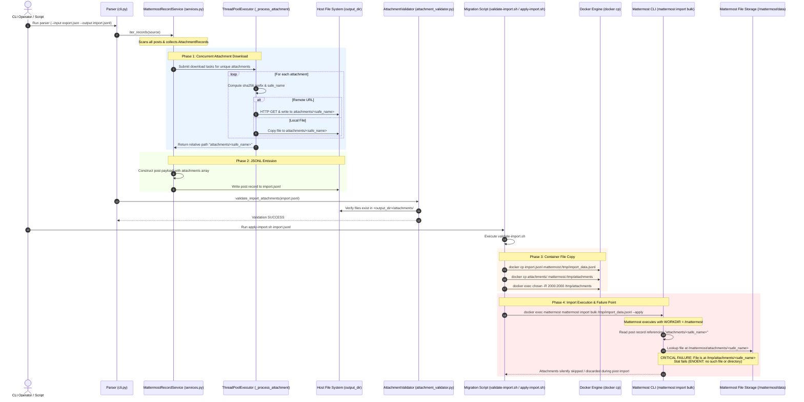

# Attachment Pipeline Architecture Audit & Root Cause Analysis

**Audit Date:** July 28, 2026  
**Auditor Role:** Google Principal Backend Engineer  
**Target Repository:** `teams-mattermost-migration`  

---

## Executive Summary

A comprehensive architectural audit of the attachment pipeline within the Teams-to-Mattermost migration platform was conducted. The audit traced the lifecycle of message attachments from initial Microsoft Teams export ingestion, through local disk downloading/staging, JSONL formatting, container copy operations, to final Mattermost bulk import execution.

The exact failure mechanism where attachments disappear during import has been isolated. The issue stems from a combination of **Docker working directory execution mismatch** during `mattermost import bulk` CLI execution, **absence of a ZIP bulk import package builder**, and minor **JSONL schema property pollution**.

---

## 1. End-to-End Attachment Lifecycle & Call Stack Trace

The attachment pipeline follows a 6-stage lifecycle:

```
[1. Teams Export JSON / MS Graph API]
               │
               ▼
[2. Parser & Reader (ijson / MSGraphExportSource)]
               │
               ▼
[3. Attachment Downloader (ThreadPoolExecutor in MattermostRecordService)]
               │  └── Writes files to <output_dir>/attachments/<hash>_<filename>
               ▼
[4. JSONL Record Writer (JsonlFileWriter)]
               │  └── Emits post records with {"attachments": [{"path": "attachments/..."}]}
               ▼
[5. Local & Container Staging (attachment_validator.py & validate-import.sh)]
               │  └── Copies JSONL to /tmp/import_data.jsonl and attachments to /tmp/attachments
               ▼
[6. Mattermost Bulk Importer (mattermost import bulk CLI)]
               │  └── [FAILURE POINT] Looks for /mattermost/attachments/... instead of /tmp/attachments/...
               ▼
[7. PostgreSQL Database & Storage Engine]
```

### Complete Code Call Stack & File Mapping

1. **CLI Entry Point & Ingestion Invocation**
   - **File:** [cli.py](file:///c:/Users/kanchiDhyana%20sai/.gemini/antigravity/scratch/teams-mattermost-migration/apps/parser/src/teams_mattermost_migration_parser/cli.py#L130-L167)
   - **Function:** `main()`
   - **Stack / Invocation:** 
     `main()` $\rightarrow$ `build_pipeline(config).run()` $\rightarrow$ `validate_import_attachments(config.output_path)`

2. **Pipeline Execution & Record Iteration**
   - **File:** [pipeline.py](file:///c:/Users/kanchiDhyana%20sai/.gemini/antigravity/scratch/teams-mattermost-migration/apps/parser/src/teams_mattermost_migration_parser/application/pipeline.py#L305-L438)
   - **Method:** `TransformationPipeline._write_records(checkpoint, resume_mode)`
   - **Stack / Invocation:**
     Iterates over `self._record_service.iter_records(self._source)`, passing yielded records to `self._writer.write_record(record)`.

3. **Attachment Extraction & Concurrent Downloader**
   - **File:** [services.py](file:///c:/Users/kanchiDhyana%20sai/.gemini/antigravity/scratch/teams-mattermost-migration/apps/parser/src/teams_mattermost_migration_parser/application/services.py#L488-L525)
   - **Method:** `MattermostRecordService.iter_records(source)`
   - **Stack / Invocation:**
     Pre-scans channel posts (`channel.posts`) and direct posts (`dc.posts`) for `post.attachments`. Submits download tasks to a `ThreadPoolExecutor` targeting `self._process_attachment(att, input_dir, output_dir)`.
   - **File:** [services.py](file:///c:/Users/kanchiDhyana%20sai/.gemini/antigravity/scratch/teams-mattermost-migration/apps/parser/src/teams_mattermost_migration_parser/application/services.py#L372-L431)
   - **Method:** `MattermostRecordService._process_attachment(attachment, input_dir, output_dir)`
   - **Action:**
     Computes 8-character SHA-256 hash of `attachment.path` (`h = hashlib.sha256(...).hexdigest()[:8]`), sanitizes the filename to `safe_name = f"{h}_{safe_orig_name}"`, downloads HTTP/HTTPS URL or copies local file to `output_dir / safe_name` (`<output_dir>/attachments/...`), and returns relative string `f"attachments/{safe_name}"`.

4. **Post Attachment JSONL Formatting**
   - **File:** [services.py](file:///c:/Users/kanchiDhyana%20sai/.gemini/antigravity/scratch/teams-mattermost-migration/apps/parser/src/teams_mattermost_migration_parser/application/services.py#L710-L721)
   - **Method:** `MattermostRecordService._render_channel_posts()` (and `iter_direct_post_records` at [services.py:774-785](file:///c:/Users/kanchiDhyana%20sai/.gemini/antigravity/scratch/teams-mattermost-migration/apps/parser/src/teams_mattermost_migration_parser/application/services.py#L774-L785))
   - **Action:**
     Appends `attachments_list.append({"path": rel_path, "file_id": file_id})` to `post_data["attachments"]` and adds `post_data["file_ids"] = file_ids`.

5. **JSONL Output Formatting & Disk Writing**
   - **File:** [writers.py](file:///c:/Users/kanchiDhyana%20sai/.gemini/antigravity/scratch/teams-mattermost-migration/apps/parser/src/teams_mattermost_migration_parser/infrastructure/writers.py#L75-L105)
   - **Method:** `JsonlFileWriter.write_record(record)` / `flush()`
   - **Action:**
     Serializes post dictionary to JSON string and writes to disk at `artifacts/imports/import.jsonl`.

6. **Host Disk Attachment Verification**
   - **File:** [attachment_validator.py](file:///c:/Users/kanchiDhyana%20sai/.gemini/antigravity/scratch/teams-mattermost-migration/apps/parser/src/teams_mattermost_migration_parser/application/attachment_validator.py#L14-L97)
   - **Function:** `validate_import_attachments(jsonl_path, raise_on_error)`
   - **Action:**
     Scans `import.jsonl`, parses `post["attachments"]`, and checks that `base_dir / att["path"]` exists on the host disk and has size $>0$ bytes.

7. **Container Staging & Copy Operations**
   - **File:** [validate-import.sh](file:///c:/Users/kanchiDhyana%20sai/.gemini/antigravity/scratch/teams-mattermost-migration/scripts/migration/validate-import.sh#L26-L38)
   - **Action:**
     `docker cp PAYLOAD_PATH container:/tmp/import_data.jsonl`
     `docker cp ATTACHMENTS_DIR container:/tmp/attachments`
     `docker exec -u 0 container chown -R 2000:2000 /tmp/attachments`

8. **Mattermost CLI Import Execution & Working Directory Mismatch (PRIMARY FAILURE POINT)**
   - **File:** [validate-import.sh](file:///c:/Users/kanchiDhyana%20sai/.gemini/antigravity/scratch/teams-mattermost-migration/scripts/migration/validate-import.sh#L41) & [apply-import.sh](file:///c:/Users/kanchiDhyana%20sai/.gemini/antigravity/scratch/teams-mattermost-migration/scripts/migration/apply-import.sh#L28)
   - **Execution:**
     `docker exec -i "${CONTAINER_ID}" mattermost import bulk "${DEST_PATH}" --apply`
   - **Docker Infrastructure File:** [docker-compose.yml](file:///c:/Users/kanchiDhyana%20sai/.gemini/antigravity/scratch/teams-mattermost-migration/infrastructure/docker/docker-compose.yml#L65-L116)

---

## 2. Component Inventory & Responsibility Matrix

| Component | Files Involved | Primary Functions | Role in Attachment Pipeline |
| :--- | :--- | :--- | :--- |
| **Parser / Reader** | [readers.py](file:///c:/Users/kanchiDhyana%20sai/.gemini/antigravity/scratch/teams-mattermost-migration/apps/parser/src/teams_mattermost_migration_parser/infrastructure/readers.py)<br/>[ms_graph_reader.py](file:///c:/Users/kanchiDhyana%20sai/.gemini/antigravity/scratch/teams-mattermost-migration/apps/parser/src/teams_mattermost_migration_parser/infrastructure/ms_graph_reader.py) | `TeamsExportFileGateway._parse_if_needed`, `MSGraphExportSource._fetch_all` | Streams raw export JSON and deserializes Teams posts and `AttachmentRecord` domain objects. |
| **Attachment Downloader** | [services.py](file:///c:/Users/kanchiDhyana%20sai/.gemini/antigravity/scratch/teams-mattermost-migration/apps/parser/src/teams_mattermost_migration_parser/application/services.py#L372-L431) | `MattermostRecordService._process_attachment`, `iter_records` | Prefetches attachments concurrently using `ThreadPoolExecutor`, hashes paths, sanitizes filenames, downloads remote URLs, copies local files to `<output_dir>/attachments/`. |
| **JSONL Writer** | [writers.py](file:///c:/Users/kanchiDhyana%20sai/.gemini/antigravity/scratch/teams-mattermost-migration/apps/parser/src/teams_mattermost_migration_parser/infrastructure/writers.py)<br/>[services.py](file:///c:/Users/kanchiDhyana%20sai/.gemini/antigravity/scratch/teams-mattermost-migration/apps/parser/src/teams_mattermost_migration_parser/application/services.py#L678-L726) | `JsonlFileWriter.write_record`, `_render_channel_posts` | Constructs JSONL post payloads with `post.attachments` arrays and writes formatted JSONL records to disk. |
| **Attachment Validator** | [attachment_validator.py](file:///c:/Users/kanchiDhyana%20sai/.gemini/antigravity/scratch/teams-mattermost-migration/apps/parser/src/teams_mattermost_migration_parser/application/attachment_validator.py) | `validate_import_attachments` | Performs host-side verification of all referenced attachment files in the JSONL before container copy. |
| **Bulk Import Stager** | [validate-import.sh](file:///c:/Users/kanchiDhyana%20sai/.gemini/antigravity/scratch/teams-mattermost-migration/scripts/migration/validate-import.sh)<br/>[apply-import.sh](file:///c:/Users/kanchiDhyana%20sai/.gemini/antigravity/scratch/teams-mattermost-migration/scripts/migration/apply-import.sh) | `validate-import.sh`, `apply-import.sh` | Copies JSONL payload to `/tmp/import_data.jsonl` and attachments to `/tmp/attachments` inside the Mattermost container. |
| **Mattermost CLI Importer** | `mattermost` binary inside container | `mattermost import bulk` | Reads JSONL import payload, processes post records, creates database entities in Postgres, and moves attachment files into Mattermost storage (`/mattermost/data/files`). |
| **Docker Infrastructure** | [docker-compose.yml](file:///c:/Users/kanchiDhyana%20sai/.gemini/antigravity/scratch/teams-mattermost-migration/infrastructure/docker/docker-compose.yml#L65-L116) | Service `mattermost` mounts: `mattermost-data:/mattermost/data` | Provides containerized Mattermost application server and storage mounts. Container `WORKDIR` is `/mattermost`. |
| **Bulk Import Package Creator** | *MISSING* | N/A | **Deficiency:** No component currently packages the JSONL file and `attachments/` folder into an `import.zip` bulk import archive format. |

---

## 3. Pipeline Sequence Diagram



---

## 4. Root Cause Analysis (Exact Failure Mechanism)

### Primary Root Cause: Working Directory Execution Mismatch in Docker Container

When `scripts/migration/validate-import.sh` (line 41) and `scripts/migration/apply-import.sh` (line 28) invoke Mattermost bulk import via `docker exec`:

```bash
docker exec -i "${CONTAINER_ID}" mattermost import bulk "${DEST_PATH}" --apply
```

1. **Relative Path Resolution in Mattermost CLI:**
   The JSONL file generated by `MattermostRecordService._render_channel_posts` specifies post attachments using relative paths:
   ```json
   {
     "type": "post",
     "post": {
       "message": "Here is the design file",
       "attachments": [
         {
           "path": "attachments/a1b2c3d4_design.pdf"
         }
       ]
     }
   }
   ```
   Mattermost's CLI binary resolves relative attachment paths relative to **the current working directory (`CWD`) of the `mattermost` process execution**.

2. **Docker Container Default `WORKDIR`:**
   As defined in the official `mattermost/mattermost-team-edition` image and `infrastructure/docker/docker-compose.yml`, the working directory of the container process is `/mattermost`.

3. **Staging Target Mismatch:**
   In `validate-import.sh` (lines 35–37), attachments are copied into `/tmp/attachments`:
   ```bash
   docker cp "${ATTACHMENTS_DIR}" "${CONTAINER_ID}:/tmp/attachments"
   ```
   When `mattermost import bulk /tmp/import_data.jsonl` executes from `/mattermost`, Mattermost attempts to open:
   $$\text{Expected Path} = \text{CWD} + \text{relative path} = \text{/mattermost/} + \text{attachments/a1b2c3d4\_design.pdf}$$
   However, the physical file exists at:
   $$\text{Actual Staged Path} = \text{/tmp/attachments/a1b2c3d4\_design.pdf}$$
   Because `/mattermost/attachments/` does not exist, file opening fails with `ENOENT`. Mattermost's import processor drops the attachment association and creates the post without attached files.

---

### Secondary Contributing Factors

1. **Absence of ZIP Bulk Import Archive Packaging:**
   Mattermost bulk import natively supports loading a single `.zip` archive containing `import.jsonl` at the root and an `attachments/` folder alongside it. When given a `.zip` archive, Mattermost extracts both the JSONL file and attachments into a temporary workspace directory and executes the import seamlessly without relying on working directory assumptions. Currently, the pipeline lacks a packaging step to create `import.zip`.

2. **JSONL Post Record Schema Pollution:**
   In `services.py` lines 716-720 (and lines 780-784):
   ```python
   attachments_list.append({"path": rel_path, "file_id": file_id})
   post_data["attachments"] = attachments_list
   post_data["file_ids"] = file_ids
   ```
   Mattermost's official Bulk Import Post schema accepts `post.attachments` containing objects with only `"path"`. Fields such as `"file_id"` inside the attachment dictionary and top-level `"file_ids"` on post objects are unrecognized schema properties during bulk import processing.

3. **Post-Import SQL Cleanup Side Effects:**
   In `apply-import.sh` lines 32–45, a raw SQL query deletes duplicate posts directly from the PostgreSQL `posts` table based on `import_id`. Direct SQL deletion bypassing Mattermost application logic can leave orphaned `fileinfo` database records and detached storage assets if rerun.

---

## 5. Complete Inventory of Files and Functions

Below is the exhaustive list of every file and function involved across the attachment pipeline:

1. **`apps/parser/src/teams_mattermost_migration_parser/domain/models.py`**
   - `AttachmentRecord`: Immutable Pydantic model for attachment metadata (`name`, `path`, `url`).
   - `PostRecord`: Includes `attachments: tuple[AttachmentRecord, ...]`.

2. **`apps/parser/src/teams_mattermost_migration_parser/infrastructure/readers.py`**
   - `TeamsExportFileGateway._parse_if_needed()`: Parses attachment objects from Teams JSON export.

3. **`apps/parser/src/teams_mattermost_migration_parser/infrastructure/ms_graph_reader.py`**
   - `MSGraphExportSource._fetch_all()`: Fetches message attachments via MS Graph API.

4. **`apps/parser/src/teams_mattermost_migration_parser/application/services.py`**
   - `MattermostRecordService._process_attachment(attachment, input_dir, output_dir)`: Hashes, sanitizes, downloads, and copies attachment files.
   - `MattermostRecordService.iter_records(source)`: Manages concurrent attachment pre-fetching.
   - `MattermostRecordService._render_channel_posts(team, channel, source)`: Formats channel post attachment structures.
   - `MattermostRecordService.iter_direct_post_records(source)`: Formats DM post attachment structures.

5. **`apps/parser/src/teams_mattermost_migration_parser/infrastructure/writers.py`**
   - `JsonlFileWriter.write_record(record)`: Serializes post JSON records containing attachment paths.

6. **`apps/parser/src/teams_mattermost_migration_parser/application/attachment_validator.py`**
   - `validate_import_attachments(jsonl_path, raise_on_error)`: Validates existence and non-zero byte size of attachments on host disk.

7. **`apps/parser/src/teams_mattermost_migration_parser/cli.py`**
   - `main()`: Executes transformation pipeline and invokes attachment validation.

8. **`scripts/migration/transform-export.sh`**
   - Invokes parser CLI with `--input` and `--output`.

9. **`scripts/migration/validate-import.sh`**
   - Copies `import_data.jsonl` to `/tmp/import_data.jsonl` and `attachments/` directory to `/tmp/attachments/` inside container.
   - Runs `docker exec -i mattermost mattermost import bulk /tmp/import_data.jsonl --validate`.

10. **`scripts/migration/apply-import.sh`**
    - Runs `validate-import.sh`.
    - Runs `docker exec -i mattermost mattermost import bulk /tmp/import_data.jsonl --apply`.
    - Runs SQL post-import cleanup query on Postgres.

11. **`infrastructure/docker/docker-compose.yml`**
    - Defines `mattermost` service, volume mounts (`mattermost-data`), and working directory context.

---

## 6. Implementation Plan for Remediation

To eliminate attachment disappearance and bring the pipeline to production enterprise standards, the following remediation steps are recommended:

### Phase 1: Docker Staging & Workdir Alignment in Shell Scripts
- Update `scripts/migration/validate-import.sh` and `apply-import.sh` to execute the `mattermost import bulk` command with the `--workdir /tmp` flag on `docker exec`:
  ```bash
  docker exec -i --workdir /tmp "${CONTAINER_ID}" mattermost import bulk /tmp/import_data.jsonl --apply
  ```
  *Alternatively*, copy attachments directly into the root working directory `/mattermost/attachments` or stage both the JSONL and `attachments/` folder under `/mattermost/data/import_staging/`.

### Phase 2: ZIP Bulk Import Package Creation
- Add an automated packaging utility in `apps/parser` (e.g. `package_import_archive()`) or in `scripts/migration/transform-export.sh` that bundles `import.jsonl` and the `attachments/` folder into an `import.zip` archive.
- Update `validate-import.sh` and `apply-import.sh` to copy `import.zip` into the container and execute `mattermost import bulk /tmp/import.zip --apply`.

### Phase 3: JSONL Attachment Schema Sanitization
- Clean up `MattermostRecordService._render_channel_posts` and `iter_direct_post_records` in `services.py` to emit standard Mattermost post attachment schemas without extraneous `file_id` or `file_ids` properties:
  ```python
  attachments_list.append({"path": rel_path})
  post_data["attachments"] = attachments_list
  ```

---

## 7. Verification & Acceptance Criteria

1. **Automated End-to-End Integration Verification:**
   - Execute `scripts/migration/transform-export.sh` followed by `scripts/migration/apply-import.sh` against sample export containing attachments.
   - Query Mattermost API (`/api/v4/posts/{post_id}/files`) or PostgreSQL database (`SELECT * FROM fileinfo;`) to confirm file metadata records exist and content hashes match.

2. **Attachment Access Verification:**
   - Verify that attached files are accessible and downloadable via Mattermost web UI/API with HTTP 200 responses.

3. **Validation Suite Execution:**
   - Execute `pytest tests/integration/test_mattermost_import.py` to confirm zero regressions across all migration flows.
